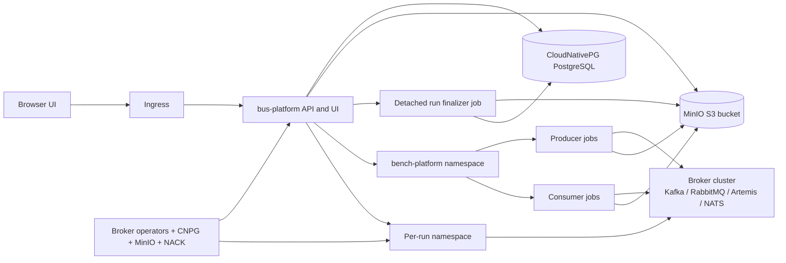

# Architecture

## Runtime model

The runtime is a FastAPI control plane deployed by the Helm chart in `deploy/charts/bus-platform`.

It is responsible for:

- serving the UI and API
- orchestrating explicit bootstrap flows when requested
- creating per-run broker namespaces
- creating producer and consumer benchmark jobs in `bench-platform`
- storing run metadata in PostgreSQL
- storing run artifacts and reports in S3-compatible storage
- launching a detached finalizer job to turn stored artifacts into final metrics

## Storage and finalization

Default runtime mode is local:

- SQLite in `runtime/bus.db`
- repo-local artifacts in `runtime/artifacts`
- repo-local reports in `runtime/reports`

External storage is explicit:

- PostgreSQL via CloudNativePG in `bench-platform-data`
- S3-compatible object storage via MinIO in `bench-platform-data`

The web pod is no longer the only place where results can be finalized. Benchmark jobs write material to durable storage, and a detached finalizer job completes aggregation independently of the web pod lifecycle.

## Exposure model

The runtime now has two explicit access modes:

1. `nodeport` for local clusters such as `k3s`, `k3d`, `kind`, `minikube`, Docker Desktop, and MicroK8s
2. `ingress` for remote clusters

The deploy script chooses `nodeport` automatically for local clusters and prints the full access URL after deployment. It no longer guesses a public hostname from a private node IP.

On WSL-backed local clusters, that `nodeport` URL uses the reachable WSL node IP rather than publishing an unusable Windows `127.0.0.1` address.

## Clean restart and verification

- `scripts/start-platform.sh`: clean restart entry point; deletes only the runtime release and run namespaces, then redeploys
- `scripts/start-platform.sh --no-clean`: in-place redeploy path
- `scripts/start-platform.sh --wipe-data`: explicit destructive reset that also removes PostgreSQL, MinIO, and repo-local runtime data
- `scripts/deploy-platform.sh`: raw deploy path used by the start script
- `scripts/install-broker-operators.sh`: installs or upgrades broker operators only
- `scripts/bootstrap-platform-data.sh`: installs or upgrades CloudNativePG, MinIO, PostgreSQL, and S3 services
- `scripts/verify-platform.sh`: checks runtime health, access URL, broker operators, CNPG, MinIO, and storage readiness
